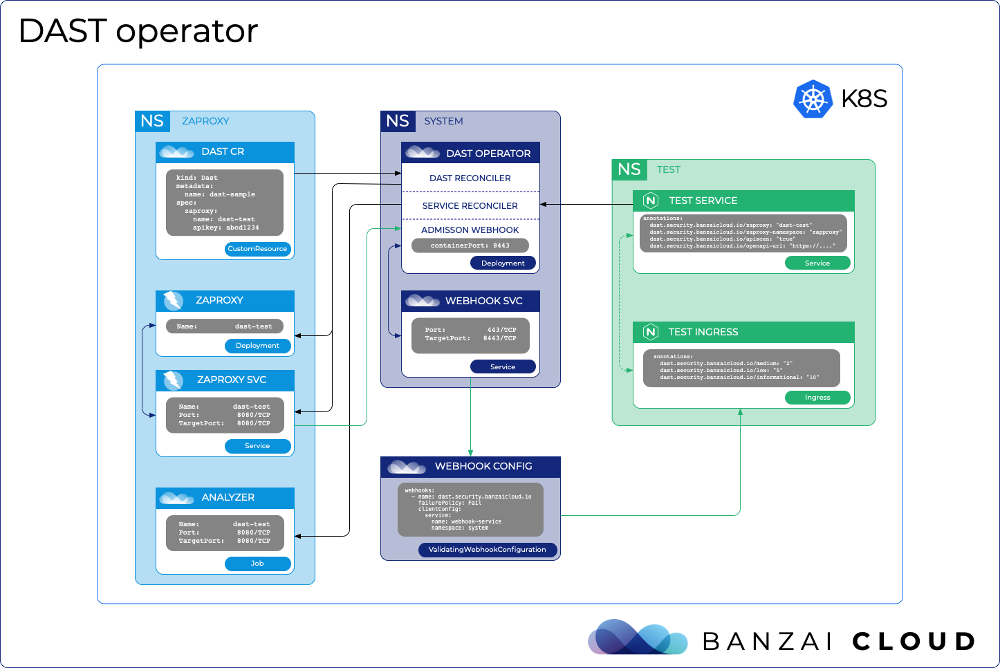

# DAST operator

> Dynamic application security testing (DAST) is a process of testing an application or software product in an operating state.

This operator leverages OWASP ZAP to make automated basic web service security testing currently.

### The operator current features:
- Deploy OWASP ZAP proxy defined in custom resource
- Scan external URL defined in custom resource
- Scan internal services based on its annotations
- API Security testing based on OpenAPI definition
- Before deploying ingress, check backend services whether scanned and scan results are below defined tresholds

### On the DAST operator roadmap:
- In webhook, check the scanner job is running, completed or not exist
- Improve service status check
- Handle multiple service ports
- Handle different service protocols
- Use HTTPS insted of HTTP connecting to ZAP
- Generate randomly ZAP API key if not defied
- API testing with JMeter and ZAP
- Parameterized security payload with fuzz
- Automaged SQLi testing usign SQLmap

## Structure of the DAST operator:
DAST operator running two reconcilers and one [validating admission webhook](https://kubernetes.io/docs/reference/access-authn-authz/admission-controllers/#validatingadmissionwebhook)



### Reconcilers
- DAST reconciler
- Service reconciler

### Webhook
- Validating webhook for ingress

## Current limitations:
Using webhook feature, deploying ingress only successfull when backend service is already scanned. If you deploy something with helm which contains service and ingress definitions as well, the ingress deployment will fail due to scan progress of the backend service won't be finished.

## Build images
```shell
git clone https://github.com/banzaicloud/dast-operator.git
cd dast-operator
make docker-build
make docker-analyzer
```

## Deploy operartor
Deploy CRD and `dast-operator` to `system` namespace.
```shell
kubectl apply -f config/crd/bases/security.banzaicloud.io_dasts.yaml
kubectl apply -f config/manager/manager.yaml
```

## Examples

### Deploy OWASP ZAP
Deploy example CR
```shell
kubectl create ns zaproxy
kubectl apply -f config/samples/security_v1alpha1_dast.yaml -n zaproxy
```

Content of Dast custom resource:
```yaml
apiVersion: security.banzaicloud.io/v1alpha1
kind: Dast
metadata:
  name: dast-sample
spec:
  zaproxy:
    name: dast-test
    apikey: abcd1234
```

### Deploy application and initiate active scan
```shell
kubectl create ns test
kubectl apply -f config/samples/test_service.yaml -n test
```

Contetnt of `test_secvice.yaml`:
```yaml
apiVersion: apps/v1
kind: Deployment
metadata:
  name: test-deployment
  labels:
    app: nginx
spec:
  replicas: 1
  selector:
    matchLabels:
      app: nginx
      secscan: dast
  template:
    metadata:
      labels:
        app: nginx
        secscan: dast
    spec:
      containers:
      - name: nginx
        image: nginx:1.16.0-alpine
        ports:
        - containerPort: 80
---
apiVersion: v1
kind: Service
metadata:
  name: test-service
  annotations:
    dast.security.banzaicloud.io/zaproxy: "dast-test"
    dast.security.banzaicloud.io/zaproxy-namespace: "zaproxy"
spec:
  selector:
    app: nginx
    secscan: dast
  ports:
  - port: 80
    targetPort: 80
```

### Deploy and test validating webhook
Deploy ValidatingWebhookConfiguration and webhook service
```shell
kubectl apply -f config/samples/webhook_config.yaml
```

Deploy ingress with previous defined `test-service` backend.
```shell
kubectl apply -f config/samples/test_ingress.yaml -n test
```

Example ingress definition:
```yaml
apiVersion: extensions/v1beta1
kind: Ingress
metadata:
  name: test-ingress
  annotations:
    dast.security.banzaicloud.io/medium: "2"
    dast.security.banzaicloud.io/low: "5"
    dast.security.banzaicloud.io/informational: "10"
    nginx.ingress.kubernetes.io/rewrite-target: /
spec:
  rules:
  - http:
      paths:
      - path: /
        backend:
          serviceName: test-service
          servicePort: 80
```


### Scan external URL
```shell
kubectl create ns external
kubectl apply -f config/samples/security_v1alpha1_dast_external.yaml -n external
```

Content of DAST CR
```yaml
apiVersion: security.banzaicloud.io/v1alpha1
kind: Dast
metadata:
  name: dast-sample-external
spec:
  zaproxy:
    name: dast-test-external
    apikey: abcd1234
  analyzer:
    image: banzaicloud/dast-analyzer:latest
    name: external-test
    target: http://example.com
```


### Defin OpenAPI definition as annotation in a service
```yaml
  apiVersion: v1
  kind: Service
  metadata:
    name: test-api-service
    annotations:
      dast.security.banzaicloud.io/zaproxy: "dast-test"
      dast.security.banzaicloud.io/zaproxy-namespace: "zaproxy"
      dast.security.banzaicloud.io/apiscan: "true"
      dast.security.banzaicloud.io/openapi-url: "https://raw.githubusercontent.com/sagikazarmark/modern-go-application/master/api/openapi/todo/openapi.yaml"
  spec:
    selector:
      app: mga
      secscan: dast
    ports:
    - port: 8000
      targetPort: 8000
```